# Laterr UI Components Canvas Document

This document provides a visual reference for all UI components available in the Laterr application.

Generated on: 2/2/2026

---

## Full Page Preview

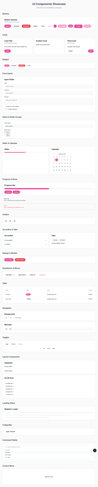

---

## Buttons

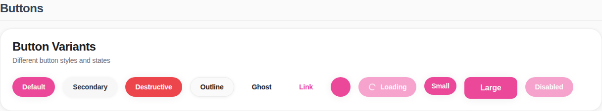

---

## Cards

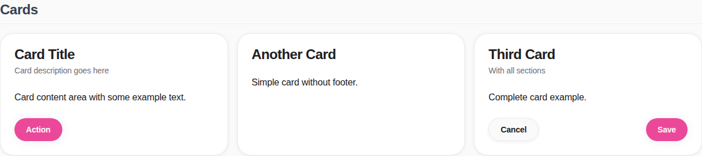

---

## Badges

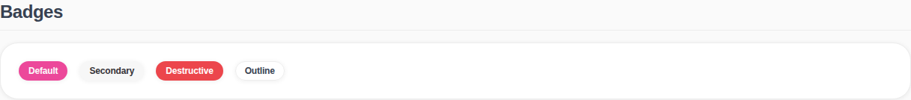

---

## Form Inputs

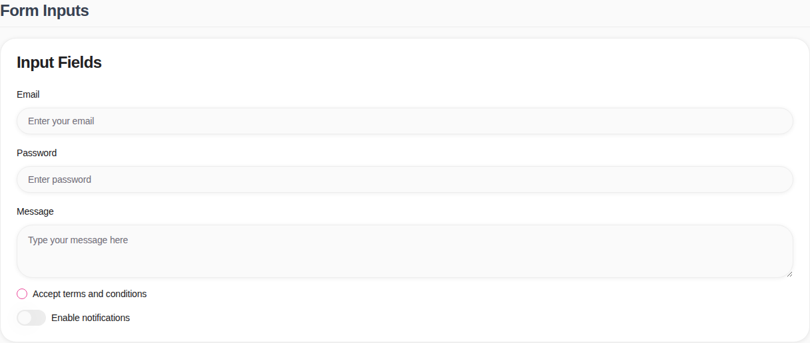

---

## Select and Radio Groups

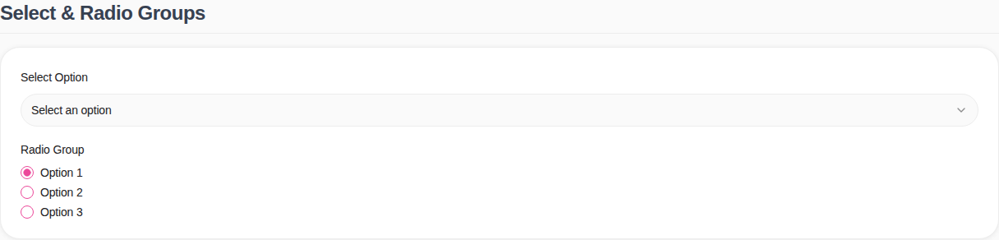

---

## Slider and Calendar

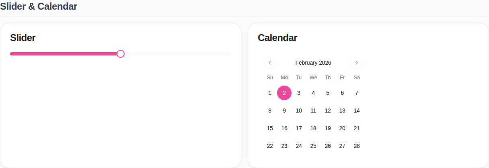

---

## Progress and Alerts

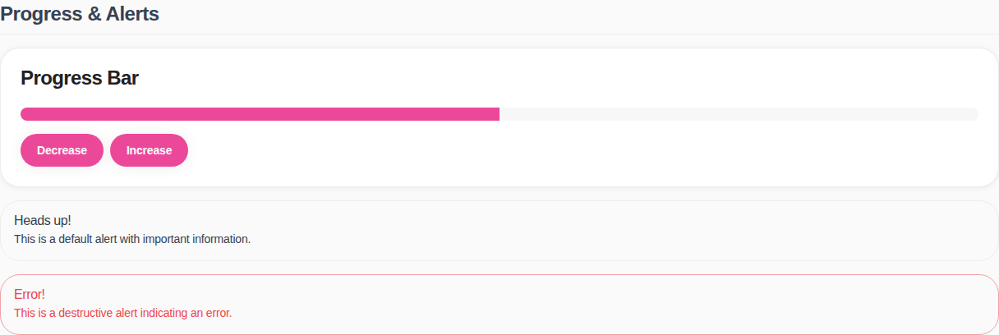

---

## Avatars

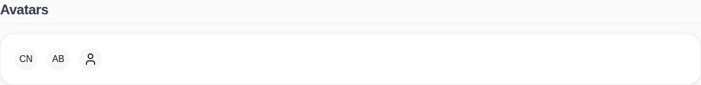

---

## Accordion and Tabs

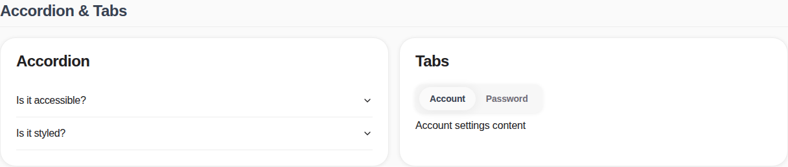

---

## Dialogs and Modals

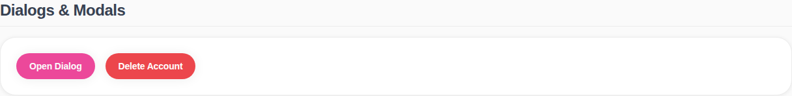

---

## Dropdowns and Menus

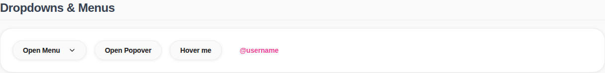

---

## Table


---

## Navigation Components

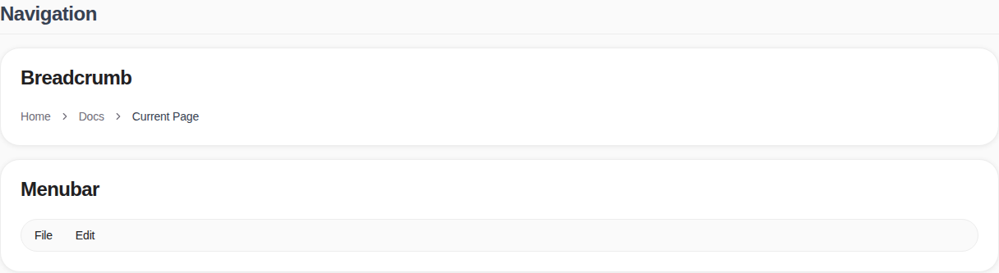

---

## Toggle Components

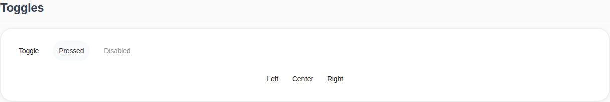

---

## Layout Components

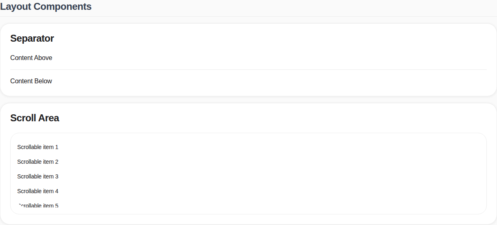

---

## Loading States

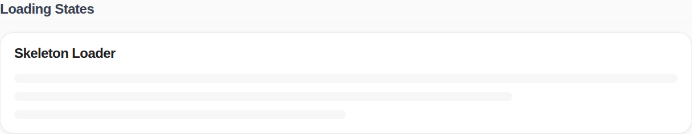

---

## Collapsible

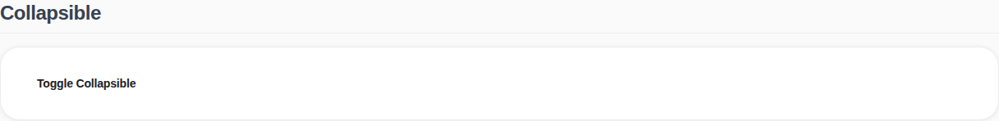

---

## Command Palette

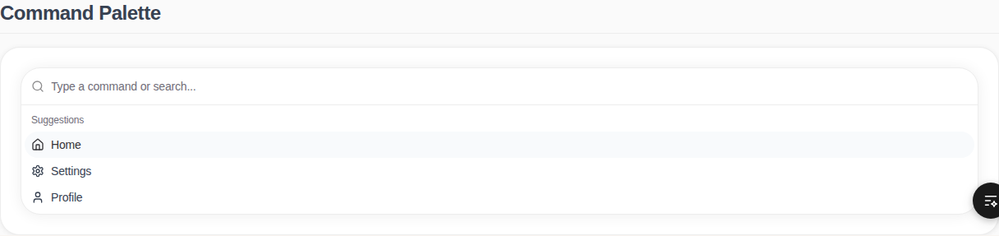

---

## Context Menu

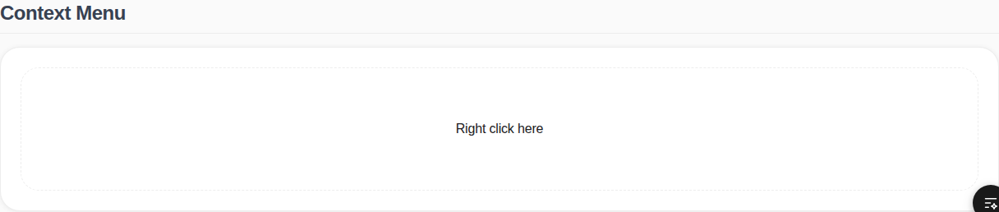

---

## Component List

The following components are available:

### Button Components
- Button (with variants: default, secondary, destructive, outline, ghost, link)
- IconButton
- LoadingButton

### Card Components
- Card
- CardHeader
- CardTitle
- CardDescription
- CardContent
- CardFooter

### Badge Components
- Badge (with variants: default, secondary, destructive, outline)

### Form Components
- Input
- Textarea
- Label
- Checkbox
- RadioGroup & RadioGroupItem
- Select (SelectTrigger, SelectValue, SelectContent, SelectItem)
- Switch
- Slider
- Calendar

### Feedback Components
- Alert (with AlertTitle, AlertDescription)
- Progress
- Toast & Toaster
- Sonner

### Media Components
- Avatar (with AvatarImage, AvatarFallback)
- Carousel

### Navigation Components
- Accordion (AccordionItem, AccordionTrigger, AccordionContent)
- Tabs (TabsList, TabsTrigger, TabsContent)
- Breadcrumb (BreadcrumbList, BreadcrumbItem, BreadcrumbLink, BreadcrumbPage, BreadcrumbSeparator)
- NavigationMenu (NavigationMenuList, NavigationMenuItem, NavigationMenuTrigger, NavigationMenuContent, NavigationMenuLink)
- Menubar (MenubarMenu, MenubarTrigger, MenubarContent, MenubarItem, MenubarSeparator)
- Collapsible (CollapsibleTrigger, CollapsibleContent)

### Modal Components
- Dialog (DialogTrigger, DialogContent, DialogHeader, DialogTitle, DialogDescription)
- AlertDialog (AlertDialogTrigger, AlertDialogContent, AlertDialogHeader, AlertDialogTitle, AlertDialogDescription, AlertDialogFooter, AlertDialogAction, AlertDialogCancel)
- Drawer
- Sheet

### Overlay Components
- DropdownMenu (DropdownMenuTrigger, DropdownMenuContent, DropdownMenuItem, DropdownMenuLabel, DropdownMenuSeparator)
- Popover (PopoverTrigger, PopoverContent)
- Tooltip (TooltipTrigger, TooltipContent)
- HoverCard (HoverCardTrigger, HoverCardContent)
- ContextMenu (ContextMenuTrigger, ContextMenuContent, ContextMenuItem)

### Data Components
- Table (TableHeader, TableBody, TableRow, TableHead, TableCell)
- Pagination

### Layout Components
- Separator
- ScrollArea
- AspectRatio
- Resizable

### Advanced Components
- Command (CommandInput, CommandList, CommandEmpty, CommandGroup, CommandItem)
- Chart
- Sidebar
- InputOTP

### Toggle Components
- Toggle
- ToggleGroup (ToggleGroupItem)

### Loading Components
- Skeleton
- LoadingSpinner

---

## Usage

All components can be imported from `@/shared/components/ui`:

```typescript
import { Button, Card, CardHeader, CardTitle, ... } from "@/shared/components/ui";
```

For detailed usage examples, please refer to the component showcase page at `/components`.
