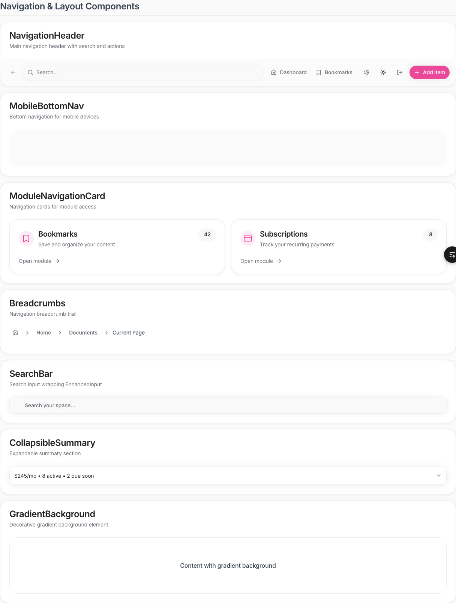
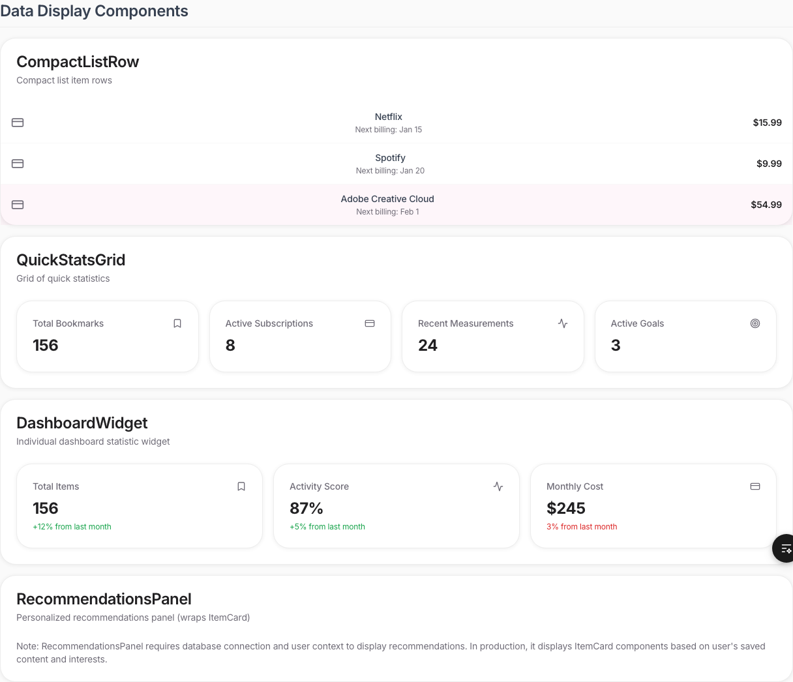
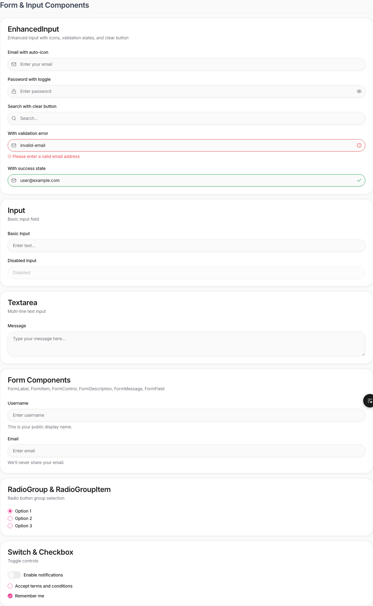
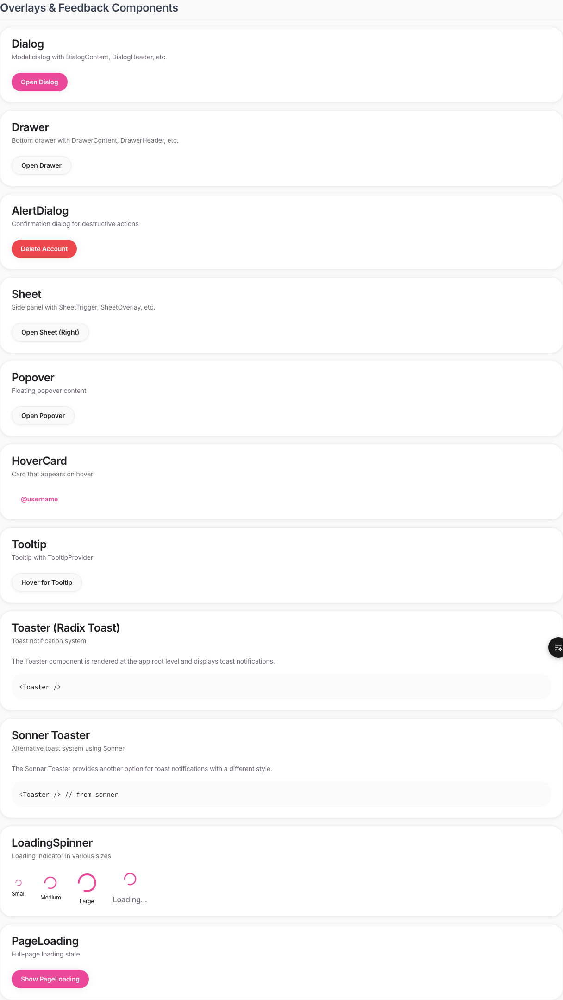
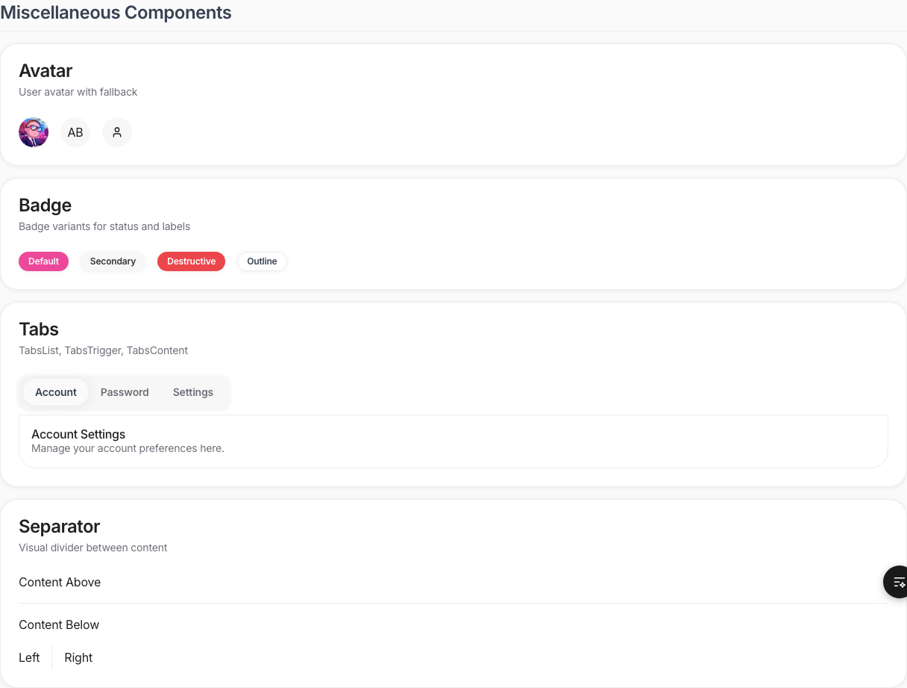

# Laterr UI Components Canvas Document

This document provides a visual reference for all UI components available in the Laterr application.

Generated on: 2/2/2026

---

## Full Page Preview


---

## Navigation & Layout Components



---

## Data Display Components



---

## Form & Input Components



---

## Overlays & Feedback Components



---

## Miscellaneous Components



---

## Component List

The following components are available:

### Navigation & Layout Components
- NavigationHeader
- MobileBottomNav
- ModuleNavigationCard
- Breadcrumbs
- SearchBar (wrapping EnhancedInput)
- CollapsibleSummary
- GradientBackground

### Data Display Components
- CompactListRow
- QuickStatsGrid
- DashboardWidget
- RecommendationsPanel (wrapping ItemCard)

### Form & Input Components
- EnhancedInput
- Input
- Textarea
- Form Components (FormLabel, FormItem, FormControl, FormDescription, FormMessage, FormField)
- RadioGroup & RadioGroupItem
- Switch & Checkbox

### Overlays & Feedback Components
- Dialog (includes DialogContent, DialogHeader, etc.)
- Drawer (includes DrawerContent, DrawerHeader, etc.)
- AlertDialog
- Sheet (includes SheetTrigger, SheetOverlay, etc.)
- Popover
- HoverCard
- Tooltip (includes TooltipProvider)
- Toaster (Radix Toast)
- Sonner Toaster
- LoadingSpinner
- PageLoading

### Miscellaneous Components
- Avatar
- Badge
- Tabs (includes TabsList, TabsTrigger, TabsContent)
- Separator

---

## Usage

All components can be imported from `@/shared/components/ui`:

```typescript
import { Button, Card, CardHeader, CardTitle, ... } from "@/shared/components/ui";
```

Custom shared components can be imported from `@/shared/components`:

```typescript
import { NavigationHeader, SearchBar, LoadingSpinner } from "@/shared/components";
```

For detailed usage examples, please refer to the component showcase page at `/components`.
